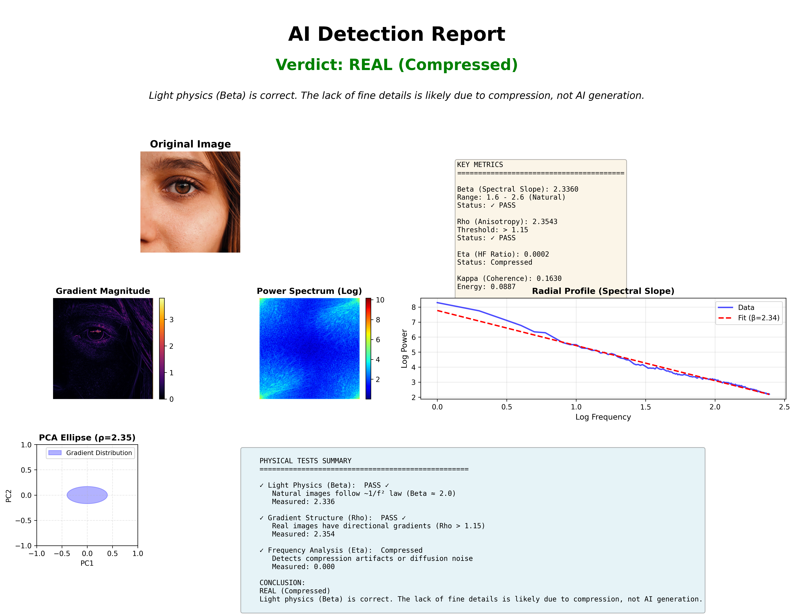
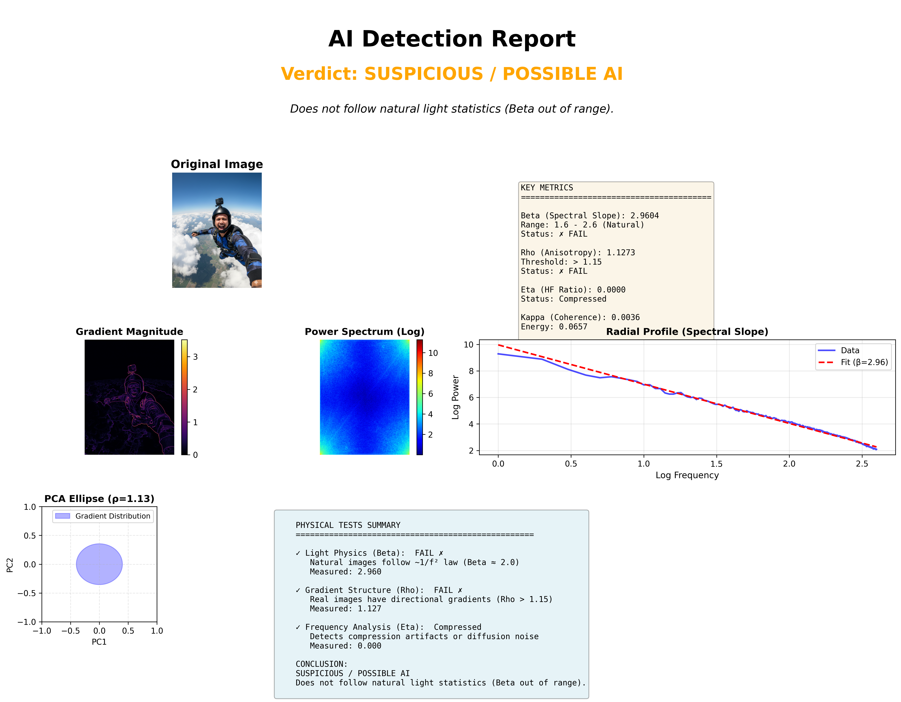

# Gradient Field PCA Detector

A comprehensive framework for detecting AI-generated images through gradient field analysis and frequency domain examination. This tool implements mathematical techniques based on natural image statistics and physical light propagation laws.

## Overview

This project provides both single-image analysis and comparative forensic tools to distinguish between real photographs and synthetically generated images. The detection methodology combines gradient-based Principal Component Analysis (PCA) with spectral analysis to identify statistical signatures characteristic of AI generation, particularly from diffusion models.

## Mathematical Foundation

### 1. Luminance Conversion

Images are first converted from RGB to luminance space using the BT.709 standard coefficients:

```
L = 0.2126 × R + 0.7152 × G + 0.0722 × B
```

where L represents the perceived luminance channel that approximates human brightness perception.

### 2. Gradient Field Analysis

#### Spatial Gradients

The luminance gradient field is computed using Sobel operators:

```
G_x = ∂L/∂x
G_y = ∂L/∂y
```

These gradients form a vector field M where each pixel corresponds to a 2D vector:

```
M = [(G_x)₁, (G_y)₁; (G_x)₂, (G_y)₂; ...; (G_x)_N, (G_y)_N]
```

#### Covariance Matrix

The gradient covariance matrix C is computed as:

```
C = (1/N) × M^T × M
```

#### Eigendecomposition

The eigenvalues λ₁ ≥ λ₂ of C characterize the directional distribution of gradients.

**Key Metrics:**

- **Anisotropy (ρ)**: The ratio of principal eigenvalues
  ```
  ρ = λ₁ / λ₂
  ```
  Real images typically exhibit high anisotropy (ρ > 1.15) due to coherent physical edges.

- **Coherence (κ)**: Normalized eigenvalue separation
  ```
  κ = ((λ₁ - λ₂) / (λ₁ + λ₂))²
  ```
  Higher coherence indicates structured gradient fields.

- **Energy**: Total gradient magnitude
  ```
  E = λ₁ + λ₂
  ```

### 3. Frequency Domain Analysis

#### Power Spectrum

The 2D Fourier transform reveals frequency content:

```
F(u,v) = ∑∑ L(x,y) × exp(-2πi(ux/M + vy/N))
```

Power spectrum:
```
P(u,v) = |F(u,v)|²
```

#### Radial Profile

The radially-averaged power spectrum S(r) aggregates power as a function of spatial frequency magnitude r.

#### Spectral Slope (β)

Natural images follow a power-law distribution in frequency space, often approximated as:

```
S(r) ∝ 1/r^β
```

Taking logarithms yields a linear relationship:

```
log(S(r)) = -β × log(r) + c
```

The slope β is estimated via linear regression. Natural images typically have β ≈ 2.0 (the "1/f²" law), corresponding to scale-invariant statistics. AI-generated images often deviate with β < 1.6 (excessive high-frequency noise) or β > 2.6 (over-smoothed, plastic appearance).

#### High-Frequency Ratio (η)

The ratio of high-frequency energy to total energy:

```
η = (∑_{r>r_c} S(r)) / (∑_{r>0} S(r))
```

where r_c is a cutoff frequency (typically r_c = min(M,N)/4).

- η < 0.01: Heavy compression (JPEG artifacts)
- η > 0.25: Excessive high-frequency noise (diffusion model artifacts)

## Detection Logic

The classification decision integrates multiple criteria:

1. **Physical Light Consistency**: 1.6 ≤ β ≤ 2.6
2. **Gradient Structure**: ρ > 1.15
3. **Frequency Anomalies**: 0.01 ≤ η ≤ 0.25

**Verdict Categories:**

- **REAL**: Passes all physical tests
- **REAL (Compressed)**: Natural β but low η (compression artifacts)
- **REAL (High Texture)**: Natural β but low ρ (natural textures like foliage)
- **AI-GENERATED**: Fails physical tests with high-frequency noise
- **SUSPICIOUS / POSSIBLE AI**: Fails physical consistency checks

## Features

### Single Image Analysis
- Comprehensive verdict with confidence assessment
- Four key metrics: Beta (β), Rho (ρ), Eta (η), Energy (E)
- Multiple visualization modes:
  - Gradient magnitude heatmaps
  - Power spectrum visualization
  - Radial profile with spectral slope fit
  - PCA ellipse representation
- Exportable high-resolution reports (300 DPI PNG)

### Comparison Mode
- Side-by-side analysis of two images
- Gradient scatter plots for visual comparison
- Comprehensive metric comparison table
- Dual visualization panels
- Exportable comparison reports

## Installation

```bash
# Clone the repository
git clone https://github.com/yourusername/gradient-field-pca-detector.git
cd gradient-field-pca-detector

# Install dependencies
pip install -r requirements.txt
```

### Requirements

```
streamlit
opencv-python-headless
numpy
scikit-learn
matplotlib
scipy
```

## Usage

### Running the Application

```bash
streamlit run app.py
```

The application will open in your default web browser at `http://localhost:8501`.

### Single Image Analysis

1. Select "Single Image Analysis" mode
2. Upload an image (JPG, PNG, JPEG, or WebP)
3. Review the automated verdict and metrics
4. Explore detailed visualizations in tabbed interface
5. Download the comprehensive report as PNG

### Comparison Mode

1. Select "Comparison Mode (2 Images)"
2. Upload two images for comparison
3. Click "Run Comparative Forensic Analysis"
4. Review side-by-side verdicts and metrics
5. Examine gradient scatter plots and power spectra
6. Download the comparison report

## Technical Details

### Image Preprocessing

Large images are automatically resized to a maximum dimension of 1024 pixels to ensure:
- Consistent gradient statistics across different image sizes
- Computational efficiency
- Reduced influence of high-resolution noise

### PCA Sampling

For computational efficiency, PCA is performed on a random sample of up to 50,000 gradient vectors when the image exceeds this size. Natural image gradient statistics are sufficiently consistent that this sampling maintains detection accuracy.

### Frequency Analysis Constraints

- DC component (r=0) is excluded from energy calculations to avoid dominance
- Analysis is restricted to frequencies below Nyquist/2 to avoid corner artifacts
- Log-space regression uses a mask: 0 < r < min(M,N)/2

## Interpretation Guidelines

### Beta (Spectral Slope)
- **1.5 - 2.8**: Consistent with natural light physics
- **< 1.5**: Excessive high-frequency content (diffusion noise)
- **> 2.8**: Over-smoothed, unnatural appearance

### Rho (Anisotropy)
- **> 1.10**: Directional gradients from physical lighting
- **< 1.10**: Isotropic noise distribution (common in AI images)

### Eta (High-Frequency Ratio)
- **< 0.01**: Heavy compression (WhatsApp, web-optimized images)
- **0.01 - 0.30**: Normal range
- **> 0.30**: Diffusion model artifacts

### Gradient Scatter Plots
- **Star/Cross pattern**: Sharp physical edges (real images)
- **Diffuse cloud**: Isotropic noise (AI-generated)
- **Elliptical**: Directional but smooth gradients

## Limitations

- Heavily post-processed real images may exhibit AI-like characteristics
- Highly textured natural scenes (grass, foliage) may show low anisotropy
- JPEG compression can mask AI artifacts in low-quality images
- Detection accuracy may vary with image resolution and content type

## Scientific Background

This implementation synthesizes concepts from:

1. **Natural Image Statistics**: The 1/f² power spectrum law observed in natural scenes
2. **Gradient Field PCA**: Coherent edge structures in physically-captured images
3. **Diffusion Model Artifacts**: High-frequency noise patterns in generative models
4. **Signal Processing**: Fourier analysis for frequency domain examination

## Output Reports

The tool generates publication-ready reports including:

- Color-coded verdict display
- Complete metrics summary
- Gradient magnitude visualization
- Log power spectrum
- Radial profile with regression fit
- PCA ellipse diagram
- Physical tests summary with pass/fail indicators
- Detailed interpretation and conclusion

All reports are exported at 300 DPI for print quality.

### Example Reports

#### Real Image Detection

*Example of a real image analysis showing natural light physics (Beta ≈ 2.0) and directional gradients.*

#### AI-Generated Image Detection

*Example of an AI-generated image detection showing anomalous spectral characteristics and suspicious patterns.*

## Use Cases

- Digital forensics and authenticity verification
- Content moderation and deepfake detection
- Academic research in computer vision
- Media integrity assessment
- Educational demonstrations of image statistics

## Contributing

Contributions are welcome. Please ensure any modifications maintain the mathematical rigor and include appropriate documentation.

## License

This project is provided for research and educational purposes.

## References

- Field, D. J. (1987). Relations between the statistics of natural images and the response properties of cortical cells.
- Simoncelli, E. P., & Olshausen, B. A. (2001). Natural image statistics and neural representation.
- Torralba, A., & Oliva, A. (2003). Statistics of natural image categories.

## Citation

If you use this tool in your research, please cite appropriately and reference the underlying mathematical principles.
